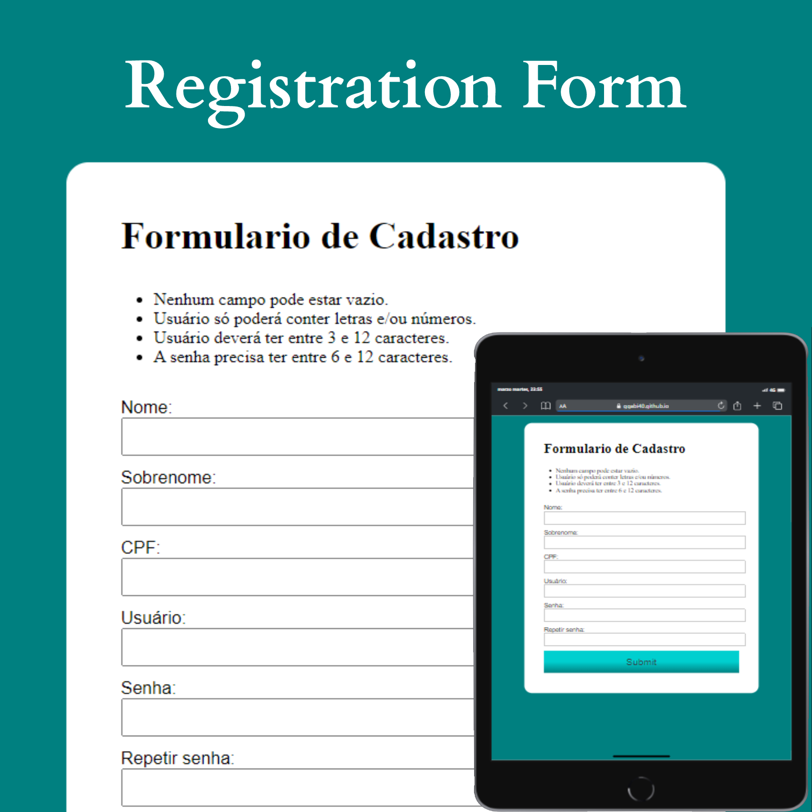
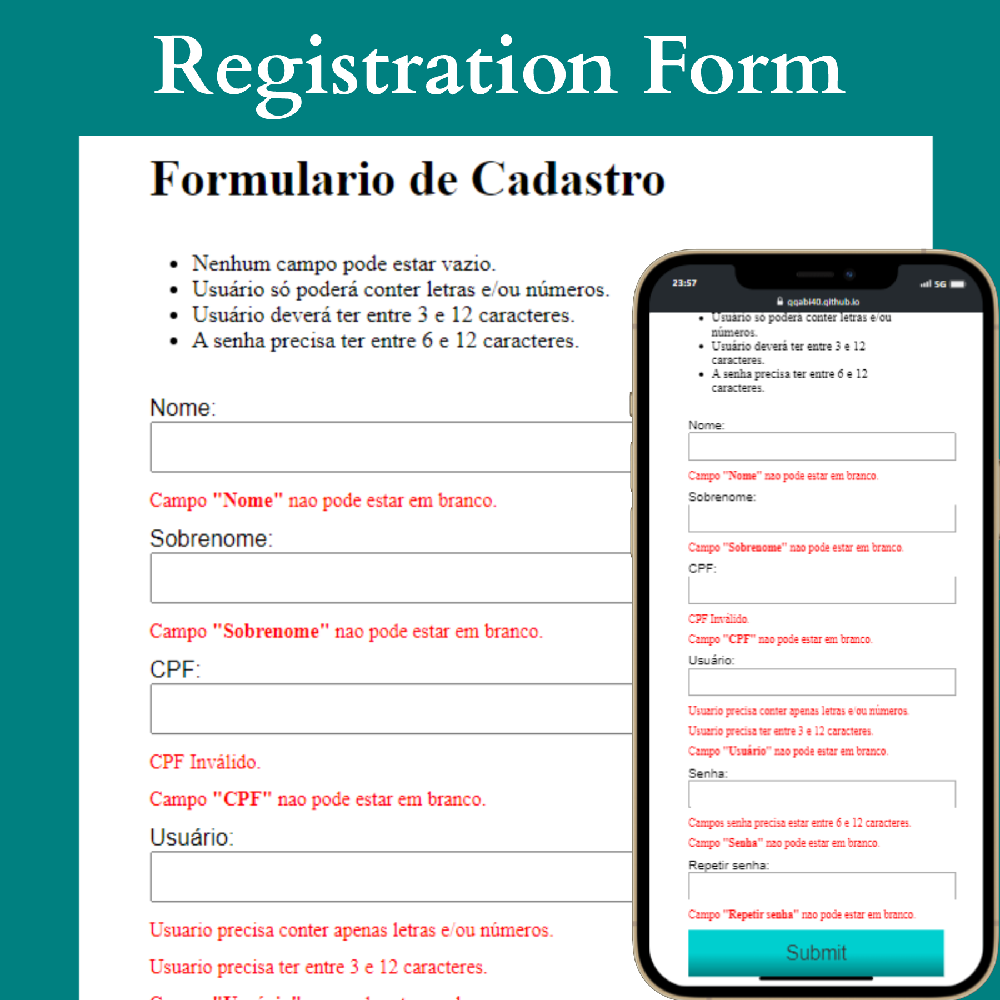

<h1>Register Form</h1>

This project is a registration form with a validation of the ID number.

I was able to learn about the validation ID and do some error messages when the information isn't correct.

<h2>💻 Project</h2>

This is a preview of the project.

 

This is a preview of all the error message of the project.

<h2>📚 Technologies:</h2>
<ul>
    <li>HTML</li>
    <li>CSS</li>
    <li>JavaScript</li>
    <li>Git and GitHub</li>
</ul>

You can see this project online: <a href="https://ggabi40.github.io/validarFormulario/">Click Here</a>!

 

Made with ♥️ by Gabi BC.
